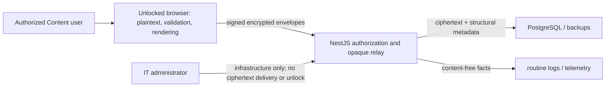
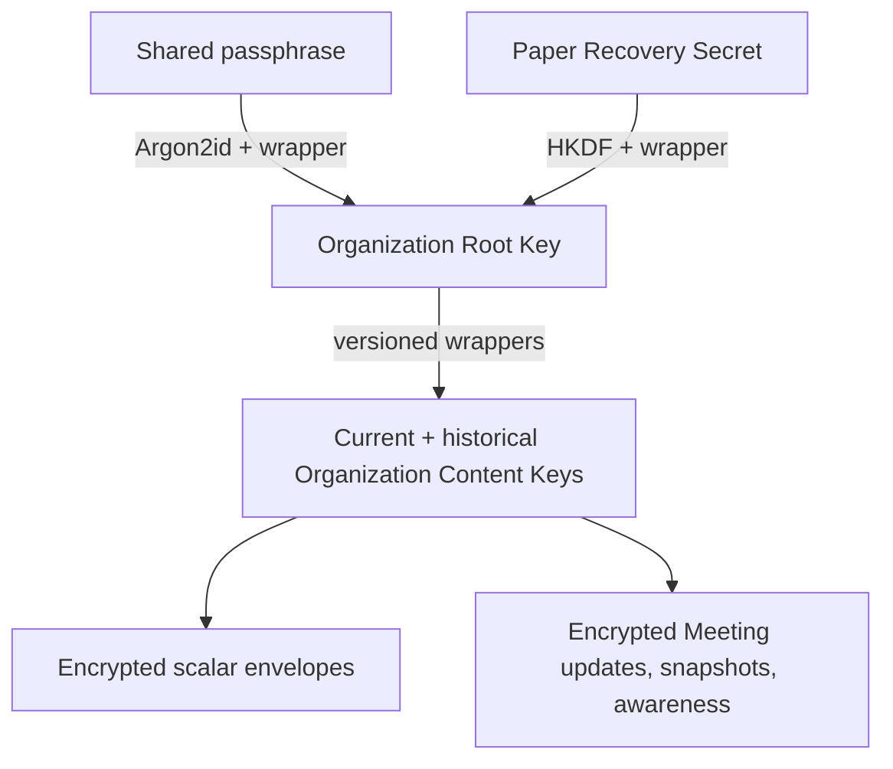

# ElderFlow E2EE security review

Reviewed revision: `62f719fc321e4da87aefac5bd69487311747a66e`

Review date: 2026-08-25. Scope: the first encrypted release implemented by issues [#48](https://github.com/FeG-Dillenburg/elderflow/issues/48), [#49](https://github.com/FeG-Dillenburg/elderflow/issues/49), [#50](https://github.com/FeG-Dillenburg/elderflow/issues/50), [#51](https://github.com/FeG-Dillenburg/elderflow/issues/51), [#52](https://github.com/FeG-Dillenburg/elderflow/issues/52), and [#53](https://github.com/FeG-Dillenburg/elderflow/issues/53), against the canonical specification [#47](https://github.com/FeG-Dillenburg/elderflow/issues/47).

This is a project-authored **internal security review**, not an independent security audit. Maintainer merge is the internal sign-off. The artifact is not an SBOM, severity system, waiver process, or substitute for a separately commissioned audit.

## Plain-language overview

ElderFlow protects the confidential text written into Topics, standalone Updates, Tasks, Meeting titles, Meeting notes, preparation text, and Minutes text. That text is encrypted in an authorized user's browser before it is sent. PostgreSQL, backups, routine logs, WebSocket relays, and an honest-but-curious infrastructure or IT administrator should see ciphertext and approved structural metadata, not readable Protected text.

Signing in and unlocking are deliberately separate. A Content user signs in with an ElderFlow account, then unlocks Protected text locally with the shared passphrase. The backend still checks the user's role and the record's Meeting state on every request. Guests receive only their approved read-only structural view; IT admins do not receive Protected ciphertext and have no unlock, recovery, or key-operation path.

The shared passphrase unlocks an Organization Root Key; that key unwraps the current and required historical Organization Content Keys; Content Keys encrypt the actual values and Meeting documents. A paper-backed Recovery Secret is a second way to unlock the Root Key. Initial setup verifies two independently sufficient paper copies. Later recovery or key changes require two distinct eligible Key operators in separate application sessions. ElderFlow never stores the plaintext Recovery Secret.

If every usable shared passphrase and every Recovery Secret copy is lost, the text is irrecoverable: the server and IT administrators do not have a master key. Suspected disclosure rotates Root and Content Keys for future writes, but cannot revoke plaintext or keys already copied by an attacker.

ElderFlow still exposes structural metadata needed to operate: account identity and roles; record IDs and ownership; Topic type/status/recurrence; Task assignment/status/due date; Meeting date/time/status, participants, agenda structure/order, sequence numbers, ciphertext sizes, versions, and content-free outcomes. Encryption does not protect against a maliciously modified served web client, a compromised Content-user device, or an authorized user deliberately copying readable text.

## How to use this review

| Audience | Start here | Then, if needed |
| --- | --- | --- |
| Leadership and administrators | Plain-language overview and [known limitations](#known-limitations-and-open-concerns) | [Protected-text inventory](#protected-text-inventory) |
| Developers | [Architecture](#technical-architecture) and [data flow](#rest-websocket-and-collaboration-flow) | [source-code review map](#source-code-review-map) |
| Operators | [running-instance guide](./e2ee-running-instance-verification.md) | [release evidence](#release-evidence) |
| Security reviewers | [six invariants](#six-invariant-release-checklist), [formats](#formats-validation-and-failure-behavior), and [source map](#source-code-review-map) | Linked ADRs, vectors, and slice evidence |

Authoritative decisions are ADRs [0012](../adr/0012-limit-e2ee-threat-model-to-storage-and-passive-infrastructure-access.md), [0013](../adr/0013-require-open-source-self-hosted-collaboration-and-encryption.md), [0014](../adr/0014-support-transient-disconnects-without-offline-first-key-storage.md), [0015](../adr/0015-keep-protected-text-unlock-independent-from-authentication.md), [0016](../adr/0016-limit-initial-collaboration-to-agenda-long-form-text.md), [0017](../adr/0017-support-multiple-devices-without-a-single-device-root.md), [0018](../adr/0018-reset-development-content-for-the-first-encrypted-release.md), [0019](../adr/0019-publish-an-e2ee-security-review-dossier.md), [0020](../adr/0020-keep-server-generated-notifications-content-free.md), and [0021](../adr/0021-control-recovery-and-key-rotation-with-two-operator-ceremonies.md). The normative byte formats are in [versioned ciphertext, key, and collaboration formats](../research/versioned-ciphertext-key-and-collaboration-formats.md).

## Threat model and trust boundaries

The trusted plaintext boundary is an authorized, separately unlocked browser context. The backend is trusted to serve the reviewed client, authenticate identities, authorize opaque records, serialize structural operations, and enforce Meeting state; it is not entrusted with Protected plaintext or decryption keys. PostgreSQL, backups, routine observability, passive HTTP/WebSocket infrastructure, and IT administrators are outside the plaintext boundary.



Protected responses use `Cache-Control: no-store`. Plaintext, unwrapped keys, decrypted projections, Yjs documents, and pending edits are volatile. The initial release has no Protected-text Web Storage, IndexedDB, Cache Storage/service-worker cache, durable offline queue, server search index, or plaintext export path.

## Protected-text inventory

| Domain owner | Protected scalar values | Collaborative values | Server-readable metadata |
| --- | --- | --- | --- |
| Topic | name, description, membership-process status, godparents | none | ID, type, lifecycle status, recurrence, responsibility, dates, sections/positions |
| Topic history | standalone Update text; completed Topic snapshot name, membership-process status, godparents | historical Meeting fragments resolved locally | entry kind, timestamps, Meeting/appearance references, skip/defer structure |
| Task | title, description | none | ID, assignment, state, due/completion dates, Topic/Meeting references |
| Meeting | title | general notes, opening input | ID, date/time, state, leader, minute taker, participants, agenda structure/order |
| Meeting appearance | completed protected Topic snapshot scalars | Person Meeting topic note; non-Person Preparation context and Meeting-minutes text | appearance/topic/section IDs, source, order, duration, state |

There is one versioned Yjs document per Meeting. Stable semantic fragment IDs are `meeting/general-notes`, `meeting/opening-input`, and immutable-appearance-ID fragments for Person notes, Preparation context, and Meeting-minutes text. PostgreSQL structure is authoritative; orphan fragments cannot recreate removed appearances.

Confirmed removed or prohibited paths: legacy plaintext Protected columns and DTOs; broad entity/relation serialization; `meeting_topics.agenda_note`; Meeting-linked Updates as Minutes; synthesized `previousMeetingTexts`; backend plaintext copy-forward, snapshotting, semantic validation, sanitization, search/filter/sort; durable browser Protected-text stores; and content-bearing server notifications.

## Technical architecture

### Key hierarchy and lifecycle



The fixed passphrase profile is Argon2id v1.3, 32-byte output, `opslimit=3`, and `memlimit=67_108_864`; v1 requires WebAssembly and does not downgrade. Unlock state ends on explicit lock, logout, reload, identity/installation or authorization change, 30 minutes of trusted foreground inactivity, or the non-extendable 12-hour absolute limit. Same-identity contexts exchange only a content-free relock signal.

Initial setup is the sole one-operator exception. Later passphrase recovery/change, Recovery Secret replacement, standalone Root rotation, and combined Root/Content rotation use one exclusive 30-minute two-operator ceremony. Both contexts verify the same canonical candidate before atomic compare-and-swap activation. Activation revokes all application sessions and browser client epochs. Routine eligible pending writes alone may use the seven-day grace; compromise rotation has no grace. Completed Meeting ciphertext is never rewritten, and historical wrappers remain readable while referenced.

### Formats, validation, and failure behavior

Deterministic CBOR envelopes use explicit kind/version/suite/codec dispatch, XChaCha20-Poly1305, HKDF-SHA-256 domain separation, Ed25519 browser-epoch signatures, per-epoch nonce prefixes and monotonic counters, scalar padding that hides null versus empty, object/field context binding, and separate server ordering. Unknown versions, noncanonical encoding, bad signatures, wrong context, replay/counter reuse, corruption, oversize input, stale parents, and non-writable keys fail closed with stable language-neutral codes.

The backend validates only public envelope/frame structure, signatures, epochs/counters, versions, sizes, authorization, sequence/idempotency, and state. The browser authenticates/decrypts, validates plaintext schemas, applies bounded Yjs updates, performs local Protected filtering/sorting/copy-forward, and sanitizes immediately before HTML sinks.

### REST, WebSocket, and collaboration flow

```mermaid
sequenceDiagram
  participant A as "Unlocked browser A"
  participant R as "REST API"
  participant W as "Opaque WebSocket relay"
  participant P as "PostgreSQL"
  participant B as "Unlocked browser B"
  A->>R: request 30-second document-bound ticket
  R-->>A: random single-use ticket
  A->>W: stable URL; ticket in first frame
  A->>W: signed encrypted Yjs update
  W->>P: validate and persist opaque update + sequence
  W-->>B: broadcast ciphertext
  B->>B: authenticate, decrypt, and apply locally
```

REST owns setup/unlock metadata, narrow scalar DTOs, Meeting bootstrap, prior-document batching, structural commands, and atomic structure-plus-initial-update mutations. The relay never instantiates a Yjs document. Awareness is separately encrypted, ephemeral, not persisted, and excluded from routine content logs.

Each local collaborative edit is encrypted immediately. Only encrypted pending envelopes remain in volatile memory during a transient disconnect. On reconnect, valid updates merge. Meeting completion atomically closes the write boundary at the committed server sequence; late divergence is rejected, discarded visibly, destroyed locally, and replaced by the canonical frozen document.

Backend authorization remains authoritative. Eligible Content users may write according to existing permissions; Guests remain read-only and do not obtain write tickets; unrelated users are denied; IT admins receive neither Protected ciphertext nor key workflows. Completion, appearance structure, role changes, ticket expiry/reuse, session revocation, and key writability are checked server-side.

## Dependencies and vectors

The consolidated [dependency review](./e2ee-dependency-review.md) matches the [pnpm lockfile](../../pnpm-lock.yaml) for all 16 E2EE/collaboration runtime packages and links the introducing-ticket rationale. No proprietary, hosted, paid-only, Hocuspocus, `y-websocket`, or production Secsync dependency is present.

Run the complete byte-exact browser/Node harness:

```sh
pnpm test:e2ee:vectors
```

Recorded 2026-08-25 at the reviewed production revision: **pass**. Backend: 6 suites / 19 tests. Frontend: 5 files / 15 tests. The shared fixtures cover RFC 5869/8032, Argon2id, key wrappers, recovery candidates, deterministic CBOR, signed/padded scalars, key-operation payloads, Meeting update/snapshot bytes, signatures, nonce epochs/counters, null/empty, version/downgrade, corruption, transplant, replay, and wrong-context rejection. Sources: [key vectors](./e2ee-v1-key-vectors.json), [vector explanation](./e2ee-v1-key-vectors.md), and [Meeting-document vectors](./fixtures/meeting-document-vectors.json).

## Six-invariant release checklist

- [x] INV-1: The backend, database, backups, and logs never receive Protected text or decryption keys. Owners: [ADR 0012](../adr/0012-limit-e2ee-threat-model-to-storage-and-passive-infrastructure-access.md), [boundary interceptor](../../backend/src/e2ee/protected-text-boundary.interceptor.ts), and the [running-instance marker gate](./e2ee-running-instance-verification.md).
- [x] INV-2: Only authorized Content users obtain opaque ciphertext and use unlock; IT admins cannot. Owners: [role policy](../../backend/src/e2ee/e2ee-role-policy.ts), [controller authorization tests](../../backend/src/e2ee/e2ee.controller.spec.ts), and [Task boundary evidence](./e2ee-task-slice-evidence.md).
- [x] INV-3: Plaintext keys are memory-only and obey the unlock-session lifetime. Owners: [ADR 0015](../adr/0015-keep-protected-text-unlock-independent-from-authentication.md), [unlock session](../../frontend/src/e2ee/unlock-session.ts), and [cleanup tests](../../frontend/src/e2ee/unlock-session.spec.ts).
- [x] INV-4: Authentication, signature, replay, version, and size failures reject closed. Owners: [normative formats](../research/versioned-ciphertext-key-and-collaboration-formats.md), [backend envelope validator tests](../../backend/src/e2ee/envelope-validator.spec.ts), and [Meeting validator tests](../../backend/src/e2ee/meeting-document-envelope-validator.spec.ts).
- [x] INV-5: Nonces are never reused within a key context. Owners: [client epoch entity](../../backend/src/e2ee/e2ee-client-epoch.entity.ts), [scalar session](../../frontend/src/e2ee/scalar-session.ts), and [byte vectors](./e2ee-v1-key-vectors.json).
- [x] INV-6: Completed Meeting ciphertext remains immutable. Owners: [ADR 0010](../adr/0010-make-completed-meetings-immutable.md), [completion transaction](../../backend/src/meetings/meetings.service.ts), [PostgreSQL completion tests](../../backend/test/meeting-completion.postgres.e2e-spec.ts), and the [late-write smoke](./e2ee-running-instance-verification.md).

## Release evidence

The standalone [running-instance verification guide](./e2ee-running-instance-verification.md) records prerequisites, exact commands, safe fixtures, UI checks, expected observations, failure conditions, cleanup, and the reviewed revision.

Recorded automated gate on 2026-08-25 against a tmpfs-backed PostgreSQL 16 container and the real NestJS REST/WebSocket server:

- create phase passed with two independent cryptographic client contexts editing multiple fragments;
- an encrypted pending edit survived disconnect, reconnected, and both contexts converged from the canonical workspace;
- raw protected HTTP responses used `no-store` and contained zero `EF54_` plaintext matches;
- incoming and outgoing WebSocket authentication/update frames contained zero marker matches;
- PostgreSQL dump scans before and after completion returned zero marker matches;
- backend restart against the unchanged database followed by sign-in/unlock recovered the exact scalar and all collaborative markers;
- locked, Guest, IT-admin, and invalid-session paths returned no plaintext or prohibited workspace;
- completion succeeded, a post-completion encrypted write returned `MEETING_COMPLETED_IMMUTABLE`, and the canonical Completed workspace remained byte-identical;
- a two-operator planned Root-key rotation advanced the authoritative generation, revoked the old session and four old client epochs, restored historical scalar/document reads in a fresh epoch, preserved Completed workspace bytes, and wrote only content-free audit facts;
- routine output and jsdom Web Storage had zero marker matches. Cache Storage and IndexedDB were inspected in physical Chrome; jsdom does not expose those stores and the automated test does not substitute a source scan.
- the full root suite passed (backend 54 suites / 189 tests; frontend 56 files / 307 tests, with the three opt-in running-instance tests skipped normally), the real-PostgreSQL E2E gate passed (9 suites / 26 tests), and both production builds completed.

The opt-in automated seam is [e2ee-release-running-instance.spec.ts](../../frontend/src/e2ee/e2ee-release-running-instance.spec.ts). A separate isolated Chrome run verified login/unlock, exact decrypted scalar display, hard-reload relock, marker-free Local/Session/Cache Storage and IndexedDB, no service-worker registrations, named dialog/textbox/buttons/navigation in Chrome's accessibility tree, and no horizontal overflow at 390 × 844. It did not execute marker creation through the UI, the full two-window journey, complete keyboard/focus traversal, or a second supported browser. Those items remain mandatory operator release checks in the guide; component/view/catalog tests support them but are not presented as equivalent physical-browser evidence.

Slice evidence remains the detailed drill-down: [keys/setup/recovery](./e2ee-key-slice-evidence.md), [Topics](./e2ee-topic-slice-evidence.md), [Tasks/dashboard](./e2ee-task-slice-evidence.md), [Meeting workspace](./e2ee-meeting-workspace-evidence.md), [collaboration](./e2ee-meeting-collaboration-evidence.md), and [key operations](./e2ee-key-rotation-evidence.md).

## Source-code review map

Every production link below has a repository-relative entry and an immutable link at the reviewed revision.

| Responsibility and invariant | Repository source | Reviewed source |
| --- | --- | --- |
| Application wiring, global plaintext-write rejection, E2EE modules | [app.module.ts](../../backend/src/app.module.ts) | [fixed](https://github.com/FeG-Dillenburg/elderflow/blob/62f719fc321e4da87aefac5bd69487311747a66e/backend/src/app.module.ts) |
| Binary HTTP limits, error/filter boundary, static client delivery | [main.ts](../../backend/src/main.ts) | [fixed](https://github.com/FeG-Dillenburg/elderflow/blob/62f719fc321e4da87aefac5bd69487311747a66e/backend/src/main.ts) |
| Content-user / IT-admin role boundary | [e2ee-role-policy.ts](../../backend/src/e2ee/e2ee-role-policy.ts) | [fixed](https://github.com/FeG-Dillenburg/elderflow/blob/62f719fc321e4da87aefac5bd69487311747a66e/backend/src/e2ee/e2ee-role-policy.ts) |
| Setup, wrappers, epochs, ceremonies, activation/revocation | [e2ee.service.ts](../../backend/src/e2ee/e2ee.service.ts) | [fixed](https://github.com/FeG-Dillenburg/elderflow/blob/62f719fc321e4da87aefac5bd69487311747a66e/backend/src/e2ee/e2ee.service.ts) |
| Narrow key and ceremony REST boundary | [e2ee.controller.ts](../../backend/src/e2ee/e2ee.controller.ts) | [fixed](https://github.com/FeG-Dillenburg/elderflow/blob/62f719fc321e4da87aefac5bd69487311747a66e/backend/src/e2ee/e2ee.controller.ts) |
| Canonical kinds/versions/media type | [e2ee-protocol.ts](../../backend/src/e2ee/e2ee-protocol.ts) | [fixed](https://github.com/FeG-Dillenburg/elderflow/blob/62f719fc321e4da87aefac5bd69487311747a66e/backend/src/e2ee/e2ee-protocol.ts) |
| Public scalar context/signature/counter validation | [e2ee-scalar.service.ts](../../backend/src/e2ee/e2ee-scalar.service.ts) | [fixed](https://github.com/FeG-Dillenburg/elderflow/blob/62f719fc321e4da87aefac5bd69487311747a66e/backend/src/e2ee/e2ee-scalar.service.ts) |
| Server rejection of legacy plaintext request fields | [protected-text-boundary.interceptor.ts](../../backend/src/e2ee/protected-text-boundary.interceptor.ts) | [fixed](https://github.com/FeG-Dillenburg/elderflow/blob/62f719fc321e4da87aefac5bd69487311747a66e/backend/src/e2ee/protected-text-boundary.interceptor.ts) |
| Browser primitives, wrappers, Argon2id, recovery candidate | [crypto.ts](../../frontend/src/e2ee/crypto.ts) | [fixed](https://github.com/FeG-Dillenburg/elderflow/blob/62f719fc321e4da87aefac5bd69487311747a66e/frontend/src/e2ee/crypto.ts) |
| Volatile unlock timers and cleanup | [unlock-session.ts](../../frontend/src/e2ee/unlock-session.ts) | [fixed](https://github.com/FeG-Dillenburg/elderflow/blob/62f719fc321e4da87aefac5bd69487311747a66e/frontend/src/e2ee/unlock-session.ts) |
| Scalar padding/encryption/decryption/context binding | [scalar-codec.ts](../../frontend/src/e2ee/scalar-codec.ts) | [fixed](https://github.com/FeG-Dillenburg/elderflow/blob/62f719fc321e4da87aefac5bd69487311747a66e/frontend/src/e2ee/scalar-codec.ts) |
| Volatile scalar keys, counters, historical read keys | [scalar-session.ts](../../frontend/src/e2ee/scalar-session.ts) | [fixed](https://github.com/FeG-Dillenburg/elderflow/blob/62f719fc321e4da87aefac5bd69487311747a66e/frontend/src/e2ee/scalar-session.ts) |
| Topic local projections and protected field inventory | [topic-scalars.ts](../../frontend/src/e2ee/topic-scalars.ts) | [fixed](https://github.com/FeG-Dillenburg/elderflow/blob/62f719fc321e4da87aefac5bd69487311747a66e/frontend/src/e2ee/topic-scalars.ts) |
| Task/dashboard local projections | [task-scalars.ts](../../frontend/src/e2ee/task-scalars.ts) | [fixed](https://github.com/FeG-Dillenburg/elderflow/blob/62f719fc321e4da87aefac5bd69487311747a66e/frontend/src/e2ee/task-scalars.ts) |
| Meeting title scalar boundary | [meeting-scalars.ts](../../frontend/src/e2ee/meeting-scalars.ts) | [fixed](https://github.com/FeG-Dillenburg/elderflow/blob/62f719fc321e4da87aefac5bd69487311747a66e/frontend/src/e2ee/meeting-scalars.ts) |
| Yjs update/snapshot/fragment codec | [meeting-document-codec.ts](../../frontend/src/e2ee/meeting-document-codec.ts) | [fixed](https://github.com/FeG-Dillenburg/elderflow/blob/62f719fc321e4da87aefac5bd69487311747a66e/frontend/src/e2ee/meeting-document-codec.ts) |
| Volatile document lifecycle, copy-forward, compaction | [meeting-document-session.ts](../../frontend/src/e2ee/meeting-document-session.ts) | [fixed](https://github.com/FeG-Dillenburg/elderflow/blob/62f719fc321e4da87aefac5bd69487311747a66e/frontend/src/e2ee/meeting-document-session.ts) |
| Browser encrypted reconnect queue and discard behavior | [meeting-collaboration.ts](../../frontend/src/e2ee/meeting-collaboration.ts) | [fixed](https://github.com/FeG-Dillenburg/elderflow/blob/62f719fc321e4da87aefac5bd69487311747a66e/frontend/src/e2ee/meeting-collaboration.ts) |
| Opaque persistence, sequencing, compaction, completion | [meeting-document.service.ts](../../backend/src/meetings/meeting-document.service.ts) | [fixed](https://github.com/FeG-Dillenburg/elderflow/blob/62f719fc321e4da87aefac5bd69487311747a66e/backend/src/meetings/meeting-document.service.ts) |
| Single-use document-bound collaboration tickets | [meeting-collaboration-ticket.service.ts](../../backend/src/meetings/meeting-collaboration-ticket.service.ts) | [fixed](https://github.com/FeG-Dillenburg/elderflow/blob/62f719fc321e4da87aefac5bd69487311747a66e/backend/src/meetings/meeting-collaboration-ticket.service.ts) |
| Blind relay authorization, validation, awareness, completion close | [meeting-collaboration-relay.service.ts](../../backend/src/meetings/meeting-collaboration-relay.service.ts) | [fixed](https://github.com/FeG-Dillenburg/elderflow/blob/62f719fc321e4da87aefac5bd69487311747a66e/backend/src/meetings/meeting-collaboration-relay.service.ts) |
| Structural transaction and Completed Meeting boundary | [meetings.service.ts](../../backend/src/meetings/meetings.service.ts) | [fixed](https://github.com/FeG-Dillenburg/elderflow/blob/62f719fc321e4da87aefac5bd69487311747a66e/backend/src/meetings/meetings.service.ts) |
| Initial key-state schema | [1720000011000-E2eeKeyState.ts](../../backend/src/database/migrations/1720000011000-E2eeKeyState.ts) | [fixed](https://github.com/FeG-Dillenburg/elderflow/blob/62f719fc321e4da87aefac5bd69487311747a66e/backend/src/database/migrations/1720000011000-E2eeKeyState.ts) |
| Topic plaintext removal / scalar schema | [1720000012000-EncryptedTopicScalars.ts](../../backend/src/database/migrations/1720000012000-EncryptedTopicScalars.ts) | [fixed](https://github.com/FeG-Dillenburg/elderflow/blob/62f719fc321e4da87aefac5bd69487311747a66e/backend/src/database/migrations/1720000012000-EncryptedTopicScalars.ts) |
| Task plaintext removal / scalar schema | [1720000013000-EncryptedTaskScalars.ts](../../backend/src/database/migrations/1720000013000-EncryptedTaskScalars.ts) | [fixed](https://github.com/FeG-Dillenburg/elderflow/blob/62f719fc321e4da87aefac5bd69487311747a66e/backend/src/database/migrations/1720000013000-EncryptedTaskScalars.ts) |
| Meeting plaintext removal / opaque workspace schema | [1720000014000-EncryptedMeetingWorkspaces.ts](../../backend/src/database/migrations/1720000014000-EncryptedMeetingWorkspaces.ts) | [fixed](https://github.com/FeG-Dillenburg/elderflow/blob/62f719fc321e4da87aefac5bd69487311747a66e/backend/src/database/migrations/1720000014000-EncryptedMeetingWorkspaces.ts) |
| Completion timestamp boundary | [1720000015000-MeetingCompletionTimestamp.ts](../../backend/src/database/migrations/1720000015000-MeetingCompletionTimestamp.ts) | [fixed](https://github.com/FeG-Dillenburg/elderflow/blob/62f719fc321e4da87aefac5bd69487311747a66e/backend/src/database/migrations/1720000015000-MeetingCompletionTimestamp.ts) |
| Ticket/client-clock collaboration schema | [1720000016000-MeetingCollaboration.ts](../../backend/src/database/migrations/1720000016000-MeetingCollaboration.ts) | [fixed](https://github.com/FeG-Dillenburg/elderflow/blob/62f719fc321e4da87aefac5bd69487311747a66e/backend/src/database/migrations/1720000016000-MeetingCollaboration.ts) |
| Active-parent compaction schema | [1720000017000-MeetingMutationCompaction.ts](../../backend/src/database/migrations/1720000017000-MeetingMutationCompaction.ts) | [fixed](https://github.com/FeG-Dillenburg/elderflow/blob/62f719fc321e4da87aefac5bd69487311747a66e/backend/src/database/migrations/1720000017000-MeetingMutationCompaction.ts) |
| In-place key-operation and historical-wrapper upgrade | [1720000018000-KeyRotationCeremonies.ts](../../backend/src/database/migrations/1720000018000-KeyRotationCeremonies.ts) | [fixed](https://github.com/FeG-Dillenburg/elderflow/blob/62f719fc321e4da87aefac5bd69487311747a66e/backend/src/database/migrations/1720000018000-KeyRotationCeremonies.ts) |
| Runtime pins and scripts | [package.json](../../package.json) | [fixed](https://github.com/FeG-Dillenburg/elderflow/blob/62f719fc321e4da87aefac5bd69487311747a66e/package.json) |
| Frontend E2EE/editor dependency pins | [frontend/package.json](../../frontend/package.json) | [fixed](https://github.com/FeG-Dillenburg/elderflow/blob/62f719fc321e4da87aefac5bd69487311747a66e/frontend/package.json) |
| Backend validator/relay dependency pins | [backend/package.json](../../backend/package.json) | [fixed](https://github.com/FeG-Dillenburg/elderflow/blob/62f719fc321e4da87aefac5bd69487311747a66e/backend/package.json) |
| Node/browser key and scalar vectors | [cross-runtime-vectors.spec.ts](../../backend/src/e2ee/cross-runtime-vectors.spec.ts) | [fixed](https://github.com/FeG-Dillenburg/elderflow/blob/62f719fc321e4da87aefac5bd69487311747a66e/backend/src/e2ee/cross-runtime-vectors.spec.ts) |
| Shared Meeting vector validation | [meeting-document-envelope-validator.spec.ts](../../backend/src/e2ee/meeting-document-envelope-validator.spec.ts) | [fixed](https://github.com/FeG-Dillenburg/elderflow/blob/62f719fc321e4da87aefac5bd69487311747a66e/backend/src/e2ee/meeting-document-envelope-validator.spec.ts) |
| Real PostgreSQL key-operation upgrade/atomicity | [e2ee-key-ceremonies.postgres.e2e-spec.ts](../../backend/test/e2ee-key-ceremonies.postgres.e2e-spec.ts) | [fixed](https://github.com/FeG-Dillenburg/elderflow/blob/62f719fc321e4da87aefac5bd69487311747a66e/backend/test/e2ee-key-ceremonies.postgres.e2e-spec.ts) |
| Real PostgreSQL opaque workspace/replay/rollback | [meeting-workspaces.postgres.e2e-spec.ts](../../backend/test/meeting-workspaces.postgres.e2e-spec.ts) | [fixed](https://github.com/FeG-Dillenburg/elderflow/blob/62f719fc321e4da87aefac5bd69487311747a66e/backend/test/meeting-workspaces.postgres.e2e-spec.ts) |
| English/German exact parity | [catalogs.spec.ts](../../frontend/src/i18n/catalogs.spec.ts) | [fixed](https://github.com/FeG-Dillenburg/elderflow/blob/62f719fc321e4da87aefac5bd69487311747a66e/frontend/src/i18n/catalogs.spec.ts) |

## Known limitations and open concerns

- A malicious server can alter the delivered JavaScript; this web architecture has no separately trusted native-client distribution boundary.
- A compromised Content-user device, malicious browser extension, screen capture, or an authorized user copying plaintext is outside scope.
- JavaScript can zero owned byte arrays and destroy Workers/documents, but cannot guarantee physical erasure from the browser engine or operating system.
- Approved structural metadata and ciphertext length/padding bucket remain visible. Traffic analysis is not prevented.
- The first release supports transient disconnects only. It has no offline login, durable key store, durable pending queue, or offline-first workflow.
- Recovery Secret custody is organizational after two paper copies are verified. Loss of every unlock path is irreversible.
- Rotation protects future writes; it cannot revoke ciphertext, keys, or plaintext already copied. Historical wrappers may remain readable indefinitely while frozen ciphertext references them.
- There is no plaintext export/search/reporting path and no content-bearing server notification path in this release.
- The primary automated smoke uses jsdom for its two independent cryptographic client contexts; a separate physical Chrome pass covered durable storage, unlock/relock, accessibility names, and phone-width overflow. UI marker creation, full two-window behavior, complete keyboard/focus traversal, and a second supported browser remain an operational release check because jsdom and one partial engine pass cannot establish that behavior.
- No unresolved implementation defect was accepted for release at the reviewed revision. The browser checks listed above are an explicitly unexecuted release-verification item, so internal sign-off must not treat the dossier alone as a completed release gate. The canonical parent [#47](https://github.com/FeG-Dillenburg/elderflow/issues/47) remains the tracking record until this final gate is accepted; future security concerns must be ordinary linked GitHub issues and, if accepted for release, added here.
